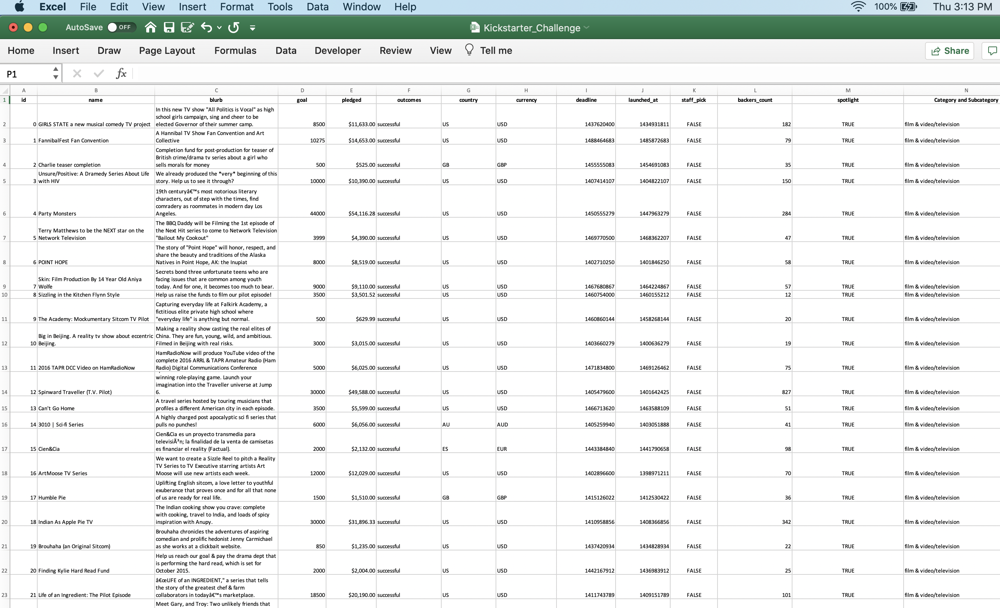

# Kickstarting with Excel

## Overview of Project
This analysis project looks at Kickstarter campaign data to find and visualize the relationships between Launch Dates and Funding Goals on campaign outcomes. Our client, Louise, has an interest in this information so she can structure her next Kickstarter campaign to be successful in helping her raise enough to fund her next play.  We used a dataset of over 4,000 Kickstarter campaigns run between 2009 and 2017 that include over 40 campaign subcategories and information on the goals, pledge amounts, outcomes, number of backers, launch & end dates of the campaigns among other related data.

 

### Purpose
The purpose of this analysis project is to provide our client, Louise, actionable insight into what month she should launch her next Kickstarter campaign and an ideal fundraising goal to set for her next campaign, based on the factors successful campaigns had in the dataset of past campaigns.

## Analysis and Challenges

### Analysis of Outcomes Based on Launch Date
After analyzing the dataset in Excel to understand the amount, formats and types of data included, we drilled down into which months had more Launch Dates for successful campaigns. We converted the Launch Date raw data from a Unix timestamp into a readable format, to see the successful and failed campaign data by month. Then we used Excel’s pivot table function, to filter the campaign data to only look at the ‘Theater’ Parent Category. 
<!-- IMAGE: link to: Table & chart created to analyze Outcomes based on Goal.png-->
From this pivot table we created a line chart that visualizes the counts of successful, failed and canceled campaigns by the month of their Launch Dates. There is a clear pattern showing more Theater campaigns launched in the months of May and June were successful than those launched in any other month over the years analyzed. Theater campaigns launched in December had the fewest successful campaigns.

### Analysis of Outcomes Based on Goals
We then looked at the Goals that the campaigns in our dataset and the relationship between these Goals and the outcomes of the campaigns. To do this we created a table of the Goals set by campaigns with a subcategory of ‘Plays’- creating several dollar-amount ranges for the Goal amounts and counting the number of campaigns in each dollar-amount range across successful, failed and canceled campaigns. We used Excel’s ‘COUNTIFS’ function to tabulate the corresponding data and calculated the percentage of each outcome versus the total number of campaigns in the ‘plays’ subcategory. 
<!-- IMAGE: link to: Table & chart created to visualize Outcomes by campaign launch date.png-->
 We created a chart of the information in this table to visualize the percentage of successful and failed campaigns by the range of Goal set.

### Challenges and Difficulties Encountered
One of the difficulties in working with the dataset is common to large datasets, it can be easy to use the wrong data or a mis-directed formula that causes errors in the analysis.  To mitigate this challenge, we double checked calculations and formulas to ensure the correct data was being pulled from the appropriate fields, and ran additional check, balance and reconciliation formulas (verifying total column and subcategory counts & totals) to ensure the data analysis is accurate and mis-specified formulas are avoided.

## Results
Based on our analysis we conclude the following about campaign Outcomes based on Launch Date:
*   Timing of campaign Launch Date matters: May & June are the months when more successful campaigns launch. 
*	December is the month with the lowest successful campaigns.

Our analysis allows us to conclude the following about campaign Outcomes based on Goals:

*   Lower Goals are more attainable. The percentage of successful campaigns with Goals under $5,000 is much larger than the success rates of campaigns with higher goals, and the success rate in general drops as Goals rise, with a caveat*. Although there are a small number of campaigns with Goals between $35,000 and $45,000 that were successful, this is a very small subset (only 9 campaigns total compared to 720 campaigns with Goals of $5,000 and lower for the “Play” subcategory). Since this number of successful campaigns with Goals between $35,000 and $45,000 is so small, they may be considered outliers or not representative of Kickstarter campaigns in general and should probably not be relied on as an indicator of likelihood of success.

**Limitations of the Kickstarter dataset used for this analysis:**

*   Dataset is over 3 years old- which may have the effect of not capturing the efficacy of Launch Dates & Goals on campaigns started at the present time
*   The dataset we utilized does not have any data on the outreach of the campaigns, like how many potential backers were targeted, and what kind of resources (like: potential backer email/social media lists, the videos or other marketing material created to explain the campaigns and entice potential backers, outreach methodologies, frequency & quality of outreach efforts) were used to advertise/promote the Kickstarter campaigns. Data on these factors could shed more light on the factors that help campaigns become successful.

**Other possible tables and/or graphs that we could create to help inform our analysis:**

*   Additional Graphs could include visualizations of data filtered to only include campaigns launched in the US 
*   Tables and graphs could be filtered to exclude outliers, which may skew the results and taint the analysis
